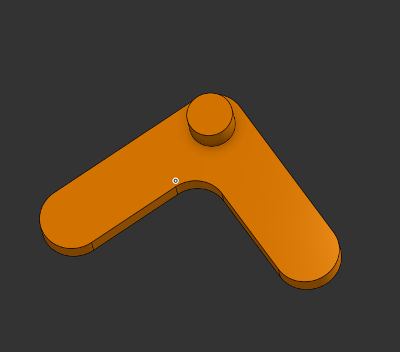
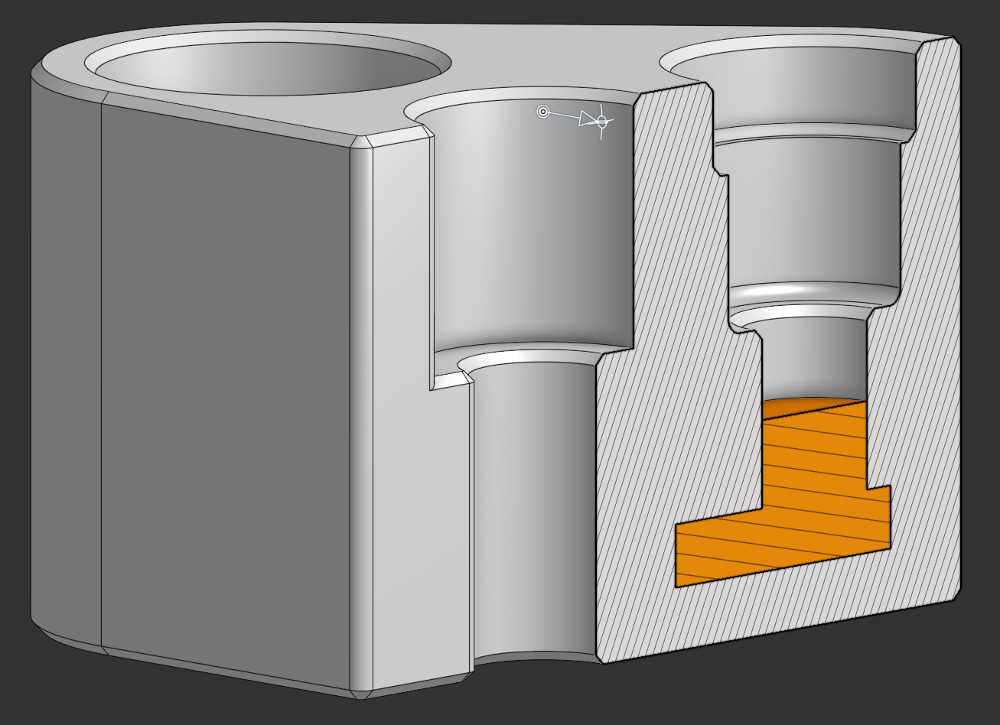
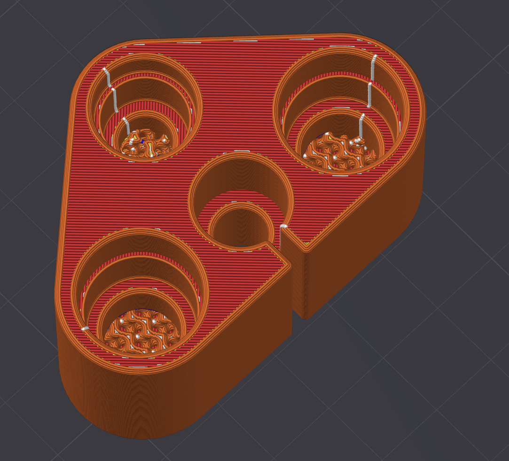
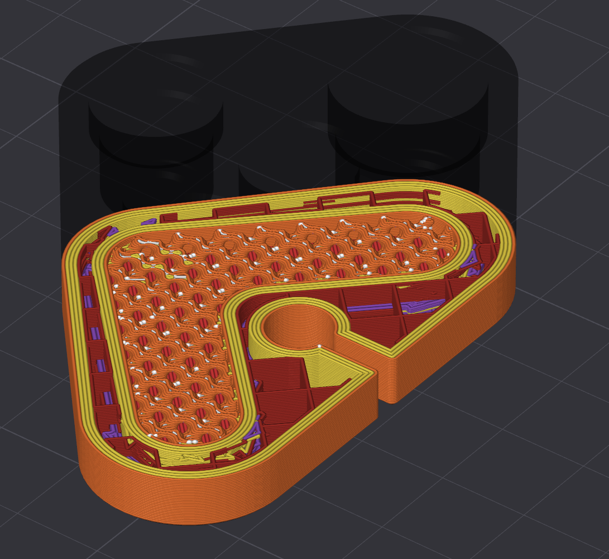
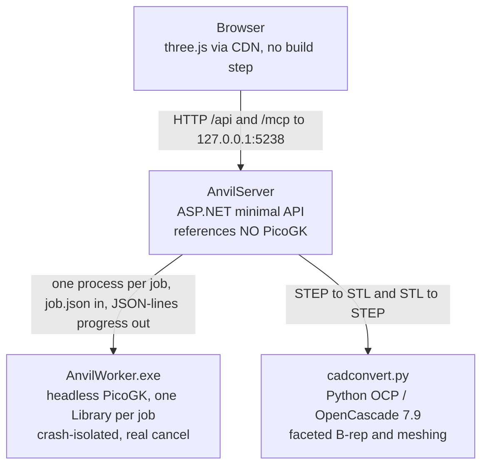

# ANVIL

**Turn solid parts and sealed cavities into printable gyroid/TPMS lattices, and get them back in CAD coordinates.** No slicer can lattice a specific cavity, and nothing else exports a result that boolean-merges straight back into your assembly, in place. ANVIL does both, on your own machine.

[](https://github.com/Delta-Robotics-Inc/anvil/actions/workflows/ci.yml)
[](LICENSE)
[](#platform-note)
[](https://dotnet.microsoft.com/)
[](https://discord.gg/W69MdWMrhH)


## Quickstart

ANVIL builds against a patched fork of [PicoGK](https://github.com/leap71/PicoGK), consumed by project reference. It must be cloned as a **sibling directory**, not inside this repo.

```powershell
cd C:\Users\you\Repos
git clone https://github.com/Delta-Robotics-Inc/anvil.git
git clone <picogk-remote> PicoGK        # see Requirements: a sibling checkout is mandatory

C:\Python314\python.exe -m pip install build123d cadquery-ocp

cd anvil
scripts\run.ps1
```

`run.ps1` builds the solution, verifies the worker exe, Python and sidecar are present, starts the server on `http://127.0.0.1:5238`, waits for `/api/health`, and opens your browser. Add `-NoBrowser` to stay headless.

Then: drag `samples\hollow_bracket.step` onto the drop zone, leave the role as **Part**, and click **GENERATE**. You get a watertight gyroid-filled solid in about a second, ready to export as STL or STEP.

> [!WARNING]
> ANVIL runs **arbitrary C# with your user privileges, by design**, and binds an **unauthenticated** port. Read [Security](#security) before you connect an agent or run a script you did not write.

## Contents

- [Why](#why)
- [The two workflows](#the-two-workflows)
- [Worked example: a pneumatic manifold](#worked-example-a-pneumatic-manifold)
- [Requirements](#requirements)
- [Parameters](#parameters)
- [Sheet vs skeletal](#sheet-vs-skeletal)
- [Zoned lattice](#zoned-lattice)
- [The tool palette](#the-tool-palette)
- [Working in the viewport](#working-in-the-viewport)
- [Export](#export)
- [Projects](#projects)
- [Flow metrics](#flow-metrics)
- [Coordinate preservation guarantee](#coordinate-preservation-guarantee)
- [Drive it from an agent (MCP)](#drive-it-from-an-agent-mcp)
- [Scripting](#scripting)
- [Security](#security)
- [Architecture](#architecture)
- [HTTP API](#http-api)
- [Testing](#testing)
- [Troubleshooting](#troubleshooting)
- [Platform note](#platform-note)
- [Contributing](#contributing)
- [Credits](#credits)
- [License](#license)

## Why

Parts with large internal voids are a problem for both major additive processes:

- **FDM** fills an enclosed void with support material you can never remove. It is sealed inside.
- **SLS / MJF** traps loose powder in the void with no escape path, adding weight and wasting material.

The fix is to fill the void with a **triply periodic minimal surface (TPMS)** lattice. A TPMS sheet is **self-supporting** (no support material) and **open-celled** (air and powder flow straight through), so it braces the walls while staying light and printable.

Slicers can only apply infill to a whole model, and mesh tools that can build a lattice hand you geometry in their own frame. ANVIL targets a specific cavity and never moves your coordinates, so the exported result drops back into Onshape or Fusion and merges with the original part without manual alignment.

## The two workflows

The role you assign each part decides the mode.

| Roles in the parts list | Mode | What happens |
| --- | --- | --- |
| exactly one **Part** | **single** | The whole solid is latticed. |
| one **Positive** + one **Negative** | **fuse** | The Negative's volume is latticed and voxel-boolean fused into the Positive, producing one watertight part. |

**Or just select what you want latticed.** With several parts loaded, selecting **one** of them targets it for single mode, and selecting a **Positive** plus a **Negative** targets that pair for fuse mode - no role juggling needed to lattice one part out of five. The selection wins over the role-derived mode, zone roles are ignored for targeting (they always layer on), and the note under `GENERATE` always names the target it is about to lattice.

For fuse mode, model the positive and the cavity negative in one shared coordinate system (as `samples\make_test_parts.py` does) and the result inherits that frame.

Only base roles decide the mode. Zone roles layer on top without changing it, and you can also build parts from scratch with [the tool palette](#the-tool-palette).

## Worked example: a pneumatic manifold

A real fuse-mode job end to end: a 58 x 39 x 27 mm three-port pneumatic manifold with one internal gallery joining the ports. This is the case ANVIL exists for, because the gallery is sealed and an FDM slicer has no way to fill it with anything but unremovable support.

**1. Model the body (the Positive).**


**2. Export the gallery as its own solid (the Negative).** In CAD, the internal air path is just a body you can export on its own. Here it is a chevron with a short cylindrical stub that rises to the centre port.



**3. Why it needs a lattice.** Sectioning the body shows the problem. The gallery (orange) is fully enclosed by the block, with no straight path to any outside face.



**4. Fuse it in ANVIL.** Load both files, set the body to **Positive** and the gallery to **Negative**, and hit **GENERATE**. The gallery is filled with a gyroid and voxel-boolean fused into the body as one watertight solid.


**5. Slice it.** The exported STL comes back in the original CAD frame, so it drops straight into the slicer. No support material is generated inside the gallery, and no powder or resin is trapped.





## Requirements

| | |
| --- | --- |
| **OS** | Windows x64 (10 or 11). See the [platform note](#platform-note). |
| **.NET** | .NET 9 SDK (`dotnet --version` reports `9.0.x`). |
| **PicoGK** | A **sibling checkout** at `..\PicoGK`. The worker references `..\..\PicoGK\src\PicoGK.csproj` directly, so the layout is mandatory. ANVIL tracks a patched fork pinned at `3725be3`; upstream `leap71/PicoGK` is not a drop-in substitute because it keeps sources at the repo root and ships no prebuilt native DLLs. See [CONTRIBUTING](.github/CONTRIBUTING.md#development-setup). |
| **PicoGK native runtime** | Copied automatically. The worker csproj copies `picogk.1.7.dll`, `blosc.dll`, `lz4.dll`, `tbb12.dll`, `zlib1.dll` and `zstd.dll` next to `AnvilWorker.exe` on build. **No System32 PicoGK install is required.** |
| **Python** | Python 3.14 with `build123d` and `cadquery-ocp` (OpenCascade 7.9). Default path `C:\Python314\python.exe`, overridable via `PythonPath` in `appsettings.json`. |
| **Internet, first load only** | The viewer pulls three.js from a CDN. |

`appsettings.json` in the repo root holds the tunables: `PythonPath`, `DataDir`, `MaxConcurrentJobs` and `WorkerPath`.

## Parameters

| Parameter | Meaning | Guidance |
| --- | --- | --- |
| **Pattern** | Gyroid, Schwarz P, Schwarz D, Lidinoid, Neovius. | Gyroid is the robust default: smooth, near-isotropic, printable in any orientation. |
| **Cell size (mm)** | Unit-cell period. | Larger is coarser, lighter and faster. Typical 6 to 12 mm. Default 8. |
| **Wall thickness (mm)** | Thickness of the TPMS sheet. | Keep at or above your printer's minimum wall (roughly line width, so 0.8 to 1.2 mm for FDM). Default 1.2. |
| **Resolution (voxel mm)** | Voxel edge length, the sampling grid. | **Smaller is finer but costs O(n^3) memory and time.** 0.2 to 0.4 mm is a good range. Default 0.3. |
| **Overlap (mm)** *(fuse only)* | How far the lattice grows past the cavity wall for a watertight joint. | 0.2 to 0.5 mm. Too small leaves a hairline seam. Default 0.3. |
| **Smoothing (mm)** | Optional triple-offset that rounds sharp lattice edges. | 0 is off and fastest. 0.1 to 0.3 softens facet ridges. |
| **Bias (mm)** *(skeletal only)* | Shifts the field iso-level, thickening or thinning the struts. Range -5 to +5. | Negative gives thinner struts and a more open channel. Replaces wall thickness in skeletal mode. |
| **Flow axis** | The direction the flow profile and permeability are measured along. | Pick the axis fluid or powder actually travels. Default Y, the up axis. |
| **Rotation / phase / per-axis cell** | Re-orient or stretch the field before sampling. | Under the **POSITION** section of the LATTICE panel. See below. |

> [!IMPORTANT]
> **Resolution guard.** The server rejects a job when the largest part dimension divided by the voxel size exceeds roughly **2000 voxels per axis**, and warns above roughly **2e9** total voxels. Start coarse (0.4 mm) and refine.

### Live preview

The `PREVIEW` row at the top of the `LATTICE` panel turns on a **GPU raymarch of the implicit field** inside the target part. It is not a bake: nothing is voxelised, nothing is sent to the worker, and every control below it writes straight into a shader uniform. Scrubbing cell size, wall thickness, bias, pattern, sheet/skeletal, rotation, phase or per-axis cell redraws the lattice frame by frame, so you can dial a part in before committing to a generate.

It targets exactly what `GENERATE` would build: the selected or role-assigned part in single mode, the **Negative** in fuse mode, since the cavity is the volume that gets filled. Change the selection or the roles and the preview follows.

**The preview is an approximation. The bake is the ground truth** for export, watertightness, volume, infill percentage and every flow metric. Three things it deliberately does not model:

- no voxelisation, so it shows detail a coarse **Resolution** would swallow;
- no smoothing offset, no island cleanup, no fuse overlap;
- the part clip is a sampled distance field rather than the exact voxelised solid.

Finishing a generate turns the preview off and shows the real mesh, with a `preview replaced by the baked result` toast. Turning the preview back on hides the baked mesh again, so the same object is never drawn at two fidelities at once. Preview state is session only and is never written to storage.

**Bounding-box fallback.** The first time a part is previewed, the server bakes a small signed-distance volume for it. While that is in flight the panel shows `BAKING PART FIELD_` and the lattice is clipped to the part's **bounding box** instead of its real shape. When the field lands the note clears and the clip tightens on its own, with no interaction needed. The field is stored in the part's own coordinates, so dragging the part with the gizmo moves the preview live and never triggers a re-bake.

**Quality.** `HIGH` is the default and refines every surface crossing. `LOW` cuts the raymarch budget and skips that refinement: thin walls can drop out at grazing angles and surfaces read slightly faceted, but it costs roughly a third as much. Counter-intuitively the expensive case is a **coarse** cell, not a fine one, because an open lattice lets most rays travel the full depth of the part instead of stopping at the first wall. On integrated graphics at a full 1080p viewport, `HIGH` measures 48 fps at a 3 mm cell, 34 fps at the 8 mm default and 27 fps at 12 mm, while `LOW` holds about 80 fps throughout. Drop to `LOW` for large cells, large parts, or any machine without a discrete GPU. Neither setting affects the bake in any way.

**Orientation matters for some patterns.** Gyroid is near-isotropic, so rotation mostly changes how walls meet the part surface. **Schwarz P is strongly anisotropic** with straight axis-aligned channels: aligning the flow axis with a channel gives far more open area than sampling off-axis, and a 45 degree rotation deliberately chokes it. For FDM, prefer rotations that keep sheet walls near-vertical along the up axis; for powder-bed processes, orientation is unconstrained.

## Sheet vs skeletal

A TPMS field `f(x,y,z) = 0` is one minimal surface dividing space into two interpenetrating volumes. The two modes keep different parts of it solid:

- **Sheet** thickens the *surface itself* into a wall. The solid is a thin membrane and **both** labyrinths either side stay open, giving two independent air networks that never connect. Best stiffness-to-weight, and the safe default for cavity venting.
- **Skeletal** keeps *one* of the two volumes solid and leaves the other as a **single** continuous channel. One connected pore means lower, more predictable flow resistance, at some cost in isotropic stiffness.

Rule of thumb: **sheet** for light bracing and powder escape on both sides, **skeletal** when one clear flow path (cooling, filtration, fluidics) matters more than symmetric stiffness.

## Zoned lattice

Instead of latticing a whole body, section off regions with generative-design-style roles layered on a base part:

- **Zone / Lattice** (blue): the lattice fills here.
- **Zone / Keep** (green): stays solid.
- **Zone / Void** (red): never latticed.

> The promise: the lattice fills the blue zones, stays **SKIN** mm inside the surface, keeps green solid, and never enters red (plus **GROW** mm).

Three offsets control it: **Skin** (inward clearance off the part surface), **Transition** (reserved for a smooth solid-to-lattice blend, accepted and stored but not yet applied) and **Keep-out grow** (outward safety margin around every void).

Zone algebra runs in a fixed order: lattice region = blue zones intersected with the body, pulled `SKIN` mm inside the surface, minus green keeps. The clipped TPMS fills that region and merges back into the body. Then, **last, so void always wins**, the grown white voids are subtracted, and a self-check confirms they are clear. In fuse mode skin is ignored (zeroed with a warning), keeps inside the cavity are re-added solid, and voids may cut into the positive by design.

With zones active, porosity and infill are measured against the **lattice region** rather than the whole bounding volume.

## The tool palette

ANVIL is an object workspace, not just a converter. Seven tools, each **taking over the left panel** with its parameters and a confirm button.

**No tool has a part dropdown.** What an op runs on is what is **selected** in the canvas or the objects list, in pick order, and the panel header is a live readout of it: a colour dot and the object's name per input. Changing the selection while a tool is open rebinds it instantly, and with nothing selected the tool shows `Select a part in the canvas or the objects list` with `CONFIRM` disabled.

**One tool per sidebar.** The left panel shows exactly one view at a time, full height: the **LATTICE** view (the home view), a single open tool, or the **SCRIPTS** editor ([Scripting](#scripting)). Nothing stacks and nothing scrolls from one tool into another. A toolbar button opens its view; `Esc` or the `✕` returns to LATTICE.

- The **LATTICE** view holds the TPMS parameters (pattern, sheet/skeletal, cell, wall or bias, resolution, overlap, smoothing, cleanup, flow axis), the **ZONES** tile once any zone role exists, a collapsible **POSITION** section (rotation, phase offset, per-axis cell size, reference flow) and the pinned **GENERATE** button.
- `GENERATE` exists **only** in the LATTICE view. While a tool is open the panel is that tool's, and its `CONFIRM` is the one filled action on screen.

| Tool | What it does | Notes |
| --- | --- | --- |
| **PRIM** | Adds a box, cylinder, sphere or cone. | Mesh-exact. Placed at an explicit center, in file coordinates, that defaults so the part rests on the plate. Cylinders and cones are authored along Y and stood up along the selected up axis, which shows as a visible, clearable rotation in `XFORM`. |
| **BOOL** | `UNION`, `DIFFERENCE`, `INTERSECT`, or `SMOOTH` (filleted union with a blend radius). | Binds to the **first two parts you picked**: `A` is the first, `B` the second, and `⇄ SWAP` exchanges them because `A − B` is not `B − A`. **Consumes its inputs**: both source rows are removed, so two parts in leaves exactly one part out and the result is the single active base part. One `Ctrl+Z` undoes the whole operation, restoring both sources with their transforms, roles and colours and removing the result. |
| **SHELL** | Hollows a part into a wall, inward, outward or centered, and leaves out the walls at any flat faces you pick as **OPEN FACES**. | Thickness must exceed 1.5x voxel. `PICK` arms the flat faces on the bound part as clickable targets: click one to leave it open (it tints green, the same language a Negative cavity uses, because open means air), click it again to close it. Detection finds **flat faces only**, so curved surfaces are not offered. The picks survive a gizmo move and clear when the bound part changes or the tool closes. No picks gives the fully closed hollow part it always did. |
| **OFFSET** | Grows or shrinks by a signed distance. | Magnitude must exceed 1.5x voxel. |
| **XFORM** | Non-destructive translate, rotate and scale with live preview. `APPLY` bakes a new part. | Its `WORLD` readout tracks the bbox centre and size live through every gizmo drag. Baking is mesh-exact, zero resolution loss. |
| **MIRROR** | Reflects across a plane, winding-corrected. | Mesh-exact. |
| **DUPE** | Instant independent copy of the selected part. | Synchronous file copy. For N copies of a whole selection, use `DUPLICATE…` in the right-click menu. |

Every tool is **non-destructive**: it runs a worker job producing a **new derived part** with a provenance line in the objects tree (for example `TPMS / GYROID`, `PRIM / BOX 60x40x20`) and a replayable snapshot of its request.

**Mesh-exact vs voxelized.** PRIM, XFORM bake and MIRROR never touch the voxel kernel, so they are geometrically exact. BOOL, SHELL and OFFSET run through PicoGK and are accurate to **plus or minus half a voxel**. Each voxel op carries its own resolution field.

The part store is **in memory**: uploaded and derived parts do not survive a server restart, even though their `data/parts/{id}/` folders remain on disk.

## Working in the viewport

- **Pick the up axis your CAD uses.** The `UP` chips in the view strip choose which world direction reads up on screen: `+Y`, `-Y`, `+Z` or `-Z`. The default is **+Y**. The choice is remembered between sessions and can be changed at any time, with parts loaded; the scene simply re-presents itself. **It is a display convention only: no geometry is moved and exports are identical in every mode.**
- **The build plate is adaptive.** It is the plane normal to the up axis, drawn at the resting height of everything visible, so an imported part sits on the bed without anything being added to it. A part that already stands on the origin plane reads as sitting at zero. `LAY FLAT`, `DROP`, the plate drag and the primitive spawn height all ground on that plate.
- **One nav cube, axes included.** For each up axis, `FRONT` is the negative of the remaining world axis (`-Z` when up is on Y, `-Y` when up is on Z) and `RIGHT` is `cross(UP, FRONT)`, so the default HOME camera is parked on the front-right-top octant and an imported CAD part faces you the way it did in CAD. The separate orientation triad is gone: the world axes now hang off the nav cube's own front-right-bottom corner, so orientation is read in one place. Faces, edges and corners all snap - hover lights the exact zone a click would take you to, in neutral gray - and the labels (`TOP` / `BOTTOM` / `FRONT` / `BACK` / `LEFT` / `RIGHT`) are derived from the same three vectors. A `TOP` snap keeps `FRONT` at the bottom of the screen, and the camera up vector never changes, so orbiting out of a top view behaves normally.
- **Section view, Onshape style.** Pick an arbitrary plane from the triad, the X/Y/Z chips, or by clicking a flat face. Caps are drawn with **diagonal hatching**, so a cut reads as material and never as a hole. Drag the arrow to move the plane, or nudge it with `Alt`+wheel (`Alt`+`Shift`+wheel for fine steps). The swap chip inverts which half survives.
- **Part-anchored gizmo** with `MOVE`, `ROTATE` and `SCALE`, plus `LAY FLAT` and `DROP`. `LAY FLAT` rests a picked face on the plate and `DROP` grounds the selection on the plate without rotating it. Grab a selected part anywhere on its surface to slide it across the plate. Rotating auto-drops the part back onto the bed as part of the same action.
- **Select several parts.** A plain click replaces the selection; `Ctrl`+click or `Shift`+click toggles a part in or out, in the canvas and in the objects list alike. The gizmo moves the whole group as one body about its combined bbox centre, and the group move is a single undo entry. The last part picked is the **primary** (a brighter accent bar on its row): numeric entry, `LAY FLAT` and the single-part tools (`SHELL`, `OFFSET`, `XFORM`, `MIRROR`, `DUPE`) bind to it, while `BOOL` takes the first two picked as `A` and `B`.
- **Right-click for the verbs.** The canvas context menu carries `DUPLICATE…` (with a copy count), `DELETE`, `HIDE` / `SHOW`, `LAY FLAT`, `DROP`, `FIT SELECTION`, `SELECT ALL` and `DESELECT ALL`, applied to the whole selection as one undo entry. Right-clicking a part that is not selected selects it first, so the menu's subject is never ambiguous. On a latticed object it also offers `SHOW GHOST` / `HIDE GHOST` and `REVERT LATTICE`.
- **Give a part its own colour.** Every row carries a colour swatch beside the eye. Clicking it opens a small picker: ten curated colours, a `HEX` field for anything else (`#rrggbb`, validated as you type, applied on `Enter`), and `RESET` to go back to the role colour. The colour drives the part's 3D tint, its row accent bar and selection border, its swatch and its `EXPORT` row, and a latticed object colours both its lattice and its ghost shell. It **survives a role change** (only `RESET` clears it) and is undoable. Colours are per session and are not saved to the part.
- **Undo and redo**, 50 deep: `Ctrl+Z`, `Ctrl+Shift+Z` or `Ctrl+Y`. Imports, tool ops, deletes, moves, role changes, colour changes, visibility toggles and lattice reverts are all reversible.
- **A lattice IS the part.** Generating does not add a second row: the source object absorbs its lattice and keeps its own name, now carrying a `LATTICE · <PATTERN>` badge where the role select was, and the lattice's triangle count and volume. The source stays on screen as a translucent ghost behind it, and the two move, export and delete as **one object**. The row's eye toggles the lattice mesh, the ghost icon toggles the shell behind it, and `REVERT` drops the lattice and gives the plain part back. Regenerating replaces the lattice in place.
- **The plate is always there.** With nothing loaded the viewport still shows the build plate framed from HOME, and `ADD PART` carries the one accent fill on screen. Deleting the last part returns to exactly that state, so the scene never reads as broken.
- **A banana for scale.** The banana icon in the view strip rests a life-size scanned banana (about 165 mm) on the build plate, beside the parts, as a size reference. It is display chrome, like the plate and the nav cube, and never a part: it is not in the objects list, cannot be selected or clicked, is ignored by fit and by the dimensions readout, is never cut by a section, and is never exported. It lies flat under whichever `UP` axis you pick, follows the plate as parts come and go, and its on/off choice is remembered between sessions.

## Export

One pipeline handles everything: tick any number of objects in the `EXPORT` tile, pick a format, export. A latticed object exports its **lattice mesh**, listed under its own name plus the pattern.

- **STL** is lossless: it *is* the result mesh.
- **STEP** is **best-effort and faceted**. The sidecar sews the triangle mesh into a faceted-BRep solid where every triangle becomes one planar face. A true analytic B-rep of a gyroid is impossible in any CAD tool, so files are large and the triangle count is budgeted: the worker coarse-remeshes above the target set by the `STEP target` stepper in the `EXPORT` tile (default 60,000), warns above 150,000, and refuses above 500,000. Roughly 60,000 triangles produces a 135 MB STEP file in about 20 seconds. Prefer STL for slicing; use STEP only when you must boolean-merge in CAD.
- **Multiple parts** export either as a **zip** of one file each, or **combined** into a single merged file.
- Per-part transforms are baked at export time, once, and **nothing is ever recentered**.

## Projects

`SAVE` and `OPEN` in the header put an entire session in one file. A **`.anvil` project** is a plain ZIP:

```
project.json          { anvil:1, savedAt, upAxis, latticeParams, parts:[ ... ] }
parts/0.stl           row 0's source mesh, binary STL, copied verbatim
parts/0_lattice.stl   its lattice mesh, when that row is latticed
parts/1.stl           ...
```

**What is bundled.** Every object in the objects list, in order: its mesh, its name, its role, its colour, its eye and ghost visibility, its `XFORM` transform, and its provenance line (`PRIM · BOX 60x40x20`, `TPMS · GYROID`). A latticed row bundles **both** meshes plus the link between them, so it reopens as one object that still moves as a body and can still be reverted. The document also carries the `UP` convention and every value in the `LATTICE` panel.

**What is not.** Scripts - they live in the server-side library and are shared across projects, so a bundle never carries a stale copy. Job artefacts and the in-flight `RESULT` tile are not bundled either; a project is the scene, not a run.

**Coordinates are preserved verbatim.** The STL bytes are copied without a single transform applied, and each row's transform travels in the manifest, so an export taken after an open is *byte-identical* to one taken before the save. That is asserted in the test suite, not just intended.

**Opening replaces the session.** With something already on the plate, `OPEN` asks first. Accepting clears the scene, the selection and **the undo history** - a reopened project is a new document, and an undo stack that could unwind past the open into the previous session would be a lie. Saving pushes nothing onto that stack: it only reads the scene.

A bundle written by a newer ANVIL is refused with the version it needs rather than half-loaded, and anything malformed - not a ZIP, no `project.json`, a missing or non-binary mesh - comes back as a `400` with the reason, leaving the current scene untouched.

## Flow metrics

When a job finishes, the **FLOW** tile reports **geometric** flow descriptors computed from the voxel field and result mesh, sampled in up to 128 bins along the chosen flow axis. These are **fast geometric estimates, not a CFD solution**: no Navier-Stokes, no turbulence, no real fluid. Use them to *compare* lattices and spot a choke, not to predict an absolute pressure drop.

| Metric | Definition | Notes |
| --- | --- | --- |
| **Porosity** | Open (air) fraction of the envelope volume. | Free volume reported in cm3. |
| **Open-area profile** | Open cross-section area per bin vs the part's envelope area. | Plotted as a sparkline. |
| **Choke** | The minimum open cross-section, and where it occurs. | The flow-limiting constriction. Choke ratio compares it to the widest slice. |
| **Specific surface** | Surface area per unit envelope volume. | High values mean good heat and mass transfer, and more drag. |
| **Hydraulic diameter** | `4 * porosity / specific surface`. | The standard porous-media characteristic pore size. |
| **Permeability** | Kozeny-Carman, in m2. | Geometric permeability of the pore network along the flow axis. |
| **Pressure drop** | Darcy, at the reference flow rate. | Labelled EST. Linear in flow, derived from the geometric permeability. |

The tile also surfaces worker warnings, for example a sheet lattice's "two independent air networks" note or a near-total choke.

## Coordinate preservation guarantee

ANVIL lets you choose which world direction is up, from the `UP` chips in the view strip: `+Y` (the default), `-Y`, `+Z` or `-Z`. The build plate is the plane normal to that axis, drawn at the resting height of whatever is on screen. **Your file's frame is never modified. The up axis only changes how the scene is presented and where the plate draws** - so switching between all four modes leaves every export byte-identical, and nothing in the part data can tell you which one was selected.

That is also why picking the right one matters: ANVIL will not silently "fix" a file exported in a different axis convention. If your CAD tool wrote the part with its feature faces toward `+Z`, choose `+Z` and it stands up. If a specific part is genuinely upside down in its own file, that belongs in an explicit `XFORM` or `LAY FLAT`, not in a hidden import correction.

Every stage (worker, sidecar and viewer) operates in the **source world frame**. STLs load force-MM and save MM, TPMS fields are world-anchored, no boolean recenters, and the viewer fits the camera with a bounding-box union instead of moving the mesh.

Consequently **the exported part lands exactly where the original did**, to within half a voxel. Import the STEP into Onshape or Fusion and it slots into place and boolean-merges with the source part, with no manual mesh alignment. Even `CENTER` in the transform panel is an explicit, visible, clearable translate, never a silent recenter.

**There are no exceptions on import.** An imported part arrives with an identity transform, always: the adaptive plate is what makes it read as resting on the bed, so nothing has to be added to the geometry to put it there. The only transforms a part ever carries are ones you can see in the `XFORM` panel and remove with `CLEAR`: your own moves, a tool result, or the convention rotation a new cylinder or cone is given so it stands up under the selected up axis (primitives are authored in ANVIL, so there is no external frame to preserve).

## Drive it from an agent (MCP)

ANVIL hosts an in-process [Model Context Protocol](https://modelcontextprotocol.io) server at `/mcp` (streamable HTTP, stateless) exposing **21 tools**. Any MCP client can list parts, run every tool op, generate lattices, run scripts and export results.

```bash
claude mcp add anvil --transport http --url http://127.0.0.1:5238/mcp
```

Tools that spawn jobs poll to completion internally (250 ms, 10 minute cap) and return the terminal job as JSON, so an agent sees synchronous results. Structured worker errors, including a script's compile diagnostics, pass straight through.

Covered surfaces: `list_parts`, `add_part_from_file`, `delete_part`, `duplicate_part`, `create_primitive`, `boolean_op`, `merge_parts`, `shell_part`, `offset_part`, `transform_part`, `mirror_part`, `generate_infill`, `get_job`, `cancel_job`, `export_step`, `get_result_stl`, `run_script`, `list_scripts`, `get_script`, `save_script`, `get_forge_reference`.

`get_forge_reference` serves [`docs/scripting.md`](docs/scripting.md) as markdown, and `run_script` / `save_script` tell an agent to read it first, so an agent writing geometry has the whole command vocabulary before its first compile.

**Connecting an agent to `/mcp` means that agent can run code on this machine.** See [Security](#security).

## Scripting

ANVIL compiles and runs user **C# scripts** (`.csx`) against the PicoGK and `Anvil.Worker` APIs in a per-job worker process. This is the escape hatch for computational parts the fixed palette cannot express: parametric heat exchangers, functionally graded lattices, anything expressible with signed distance fields. Run one from the **SCRIPTS** toolbar view, `POST /api/scripts/run`, or the `run_script` MCP tool.

**SCRIPTS** is a toolbar view sitting between DUPE and LATTICE, and it takes the left panel the way every other tool does: click to open, click again to close. The panel widens while it is open, because this view reads code rather than parameters. Inside it is a canvas-plus-terminal workspace: an **EXAMPLES** picker listing the bundled examples and everything you have saved, a monospace editor with a line-number gutter (lines soft-wrap, so there is no horizontal scrolling and a wrapped line keeps a single number beside it; Tab indents two spaces, Ctrl+Z is ordinary text undo and never touches the app history), and **RUN**. RUN posts the editor's text, shows the job's stage inline with a CANCEL beside it, and lands every part the script saved straight in the canvas and the OBJECTS tree, drawn **solid** like any finished model rather than as a ghost, so a whole run undoes as one step. A compile failure lists Roslyn's errors with their line and character; clicking one puts the caret on that line. **SAVE** names the buffer and files it under your saved scripts, **UPLOAD** reads a `.csx` off disk into the editor, and **TOOLS ?** opens the scripting reference. Ctrl+Enter runs from anywhere in the view.

Globals available unqualified: `Params` and the typed readers `ParamF` / `ParamS` / `ParamB`, `VoxelSizeMM`, `SavePart(name, Shape)` (meshes the field, removes floating islands, watertight-checks and registers it), `SavePart(name, Voxels)`, `SavePart(name, Mesh)`, and `Log(msg)`. Imported automatically: the **Forge** command set, `PicoGK` (`Voxels`, `Mesh`, `IImplicit`, `BBox3`, booleans and offsets), `Anvil.Worker` (`MeshUtil`, `TPMSWall`), plus `System`, `System.Numerics` and a static `Math`.

### The Forge API

Scripts are written against **Forge**, a flat command layer over the voxel kernel that is auto-imported into every `.csx`. Units are millimetres, angles are degrees, +Y is up, and every builder's `at` is the shape's centre and defaults to the origin. Commands never mutate their inputs. The five commands that have an axis — `Cylinder`, `Cone`, `Loft`, `Torus` and `ArrayRadial` — take `axis: "z"` to build along +Z instead, which is what a part destined for the viewer's default up axis or a build plate wants.

```csharp
Shape plate = Box(60, 4, 40);
Shape boss  = Cylinder(d: 12, h: 8, at: V(0, 6, 0));
Shape body  = SmoothUnion(plate, boss, radius: 2);
Shape holes = ArrayRadial(Cylinder(4, 20), count: 6, radius: 20);
SavePart("bracket", Subtract(body, holes));
```

**[`docs/scripting.md`](docs/scripting.md) is the canonical reference**: every command with its signature, units, defaults and meaning, grouped into builders (`Box`, `Cylinder`, `Cone`, `Sphere`, `Capsule`, `Torus`, `Loft`, `Pipe`, `Beams`, `Spheres`, `FromFile`), combinators (`Union`, `Subtract`, `Intersect`, `SmoothUnion`), modifiers (`Move`, `RotateX/Y/Z`, `Scale`, `Mirror`, `Shell`, `Offset`, `Smooth`, `Fillet`, `ArrayLinear`, `ArrayRadial`, `Lattice`, `Emboss`) and info (`Volume`, `Area`, `BBox`, `Center`), plus the script globals, the `axis` modifier for building along +Z, the voxel-size rule, what actually costs time, how to write your own `IImplicit`, and a worked example. The `TOOLS ?` button in the SCRIPTS view opens it, and the `get_forge_reference` MCP tool serves it to agents.

Seven annotated examples live in [`scripts-library/`](scripts-library) and show up in the EXAMPLES picker. Every one of them stands on the plate at `z = 0`; the first three each state their own recommended `voxelSizeMM` and validate every parameter against the voxel size before they build anything:

| Script | What it makes |
| --- | --- |
| `rocket_nozzle.csx` | A regeneratively-cooled bell nozzle, exit plane down on the plate: Rao contour, hot-gas wall graded from 1.4 mm at the throat to 0.9 mm at the exit, 22 helical cooling channels with self-supporting teardrop roofs wrapping the bell under a jacket grown from the coolant volume itself, inlet and outlet manifold rings, bolted injector flange. 8,558 tapered `Beams` in one render. The flagship "math in, part out" demo. |
| `heat_exchanger.csx` | A two-domain TPMS counterflow heat exchanger: a gyroid splits the core into two interpenetrating circuits, each sealed against a different boundary so each gets its own headers, and the metal is *derived* as the complement of the fluid. The script measures the overlap of the two circuits and refuses to save if it is anything but zero. |
| `compliant_wheel.csx` | An airless O180 mm rover wheel: bolted hub, three concentric bands of counter-handed logarithmic-spiral ribs (12, then 24, then 48, thinning outward), a rim and a chevron tread. The ribs are the level sets of an `IImplicit` written in the script — 15 lines, any rib count. |
| `embossed_card.csx` | An 85.6 by 54 by 1.6 mm card with the ANVIL emblem raised on the front and engraved on the back from one depth map, via `Emboss` in both modes. |
| `manifold_block.csx` | A ported pneumatic manifold standing on the plate: `ArrayLinear` bores drilled down the top face, a `Pipe` gallery joining them, and a gyroid `Lattice` filling that gallery. The ANVIL story in one script. |
| `graded_lattice_puck.csx` | A 40 by 15 mm puck filled with a radially graded skeletal gyroid via a custom inline `IImplicit` — dense at the rim, open in the middle. |
| `forge_smoke.csx` | Two demo parts plus an assertion per Forge command, checked against the analytic answer. An executable spec. |

Scripts you save land in `data/scripts/` (gitignored, slugified, path traversal rejected). Part provenance stores the script name, params and SHA-256, never the source.

> [!CAUTION]
> **Scripts execute arbitrary C# with your full user privileges. There is no sandbox.** Treat a `.csx` exactly like an executable someone handed you: read it before you run it.

## Security

**Read this before exposing the port or connecting an agent.** The full policy, including what is and is not a reportable vulnerability, is in [SECURITY.md](.github/SECURITY.md).

- **No sandbox.** Scripts run arbitrary C# and can read, write and delete anything your account can. MCP tools run geometry ops, and `add_part_from_file` reads arbitrary absolute paths.
- **The server binds `127.0.0.1` only and has no authentication.** Anyone who can reach the port can drive every tool and run arbitrary code. Do not bind it to a public interface, port-forward it, or put it behind a tunnel.
- **Connecting an agent to `/mcp` grants that agent code execution on this machine.** Only connect agents you trust.
- Per-job worker processes give crash isolation and cleanup, **not** a security boundary.

To report a vulnerability, use [private vulnerability reporting](https://github.com/Delta-Robotics-Inc/anvil/security/advisories/new) or email mark@deltaroboticsinc.com. Never open a public issue for one.

## Architecture

Three cooperating processes keep PicoGK's native constraints (one `Library` per process, process-global voxel size, native crashes kill the host) isolated from the web host.



The server only shells out: it queues jobs (bounded by `MaxConcurrentJobs`), spawns one `AnvilWorker.exe` per job with a `job.json`, parses JSON-lines progress from stdout, and calls the Python sidecar for STEP. **All voxel math lives in the worker.**

## HTTP API

Base path `/api`, JSON is camelCase, server binds `http://127.0.0.1:5238`.

| Method | Route | Purpose |
| --- | --- | --- |
| `GET` | `/api/health` | Liveness plus worker and Python paths. |
| `GET` `POST` `DELETE` | `/api/parts` | List, upload (`.stl` / `.step` / `.stp`) and delete parts. |
| `GET` | `/api/parts/{id}/mesh.stl` | Binary STL for the preview. |
| `POST` | `/api/ops` | Run a tool op, producing a new derived part. `duplicate` returns `200`; everything else returns `202` and finishes as a job. |
| `POST` | `/api/jobs` | Start a lattice generate. Returns `202`. |
| `GET` `POST` | `/api/jobs/{id}` , `/api/jobs/{id}/cancel` | Poll status (the UI polls at 500 ms) or kill the worker. |
| `POST` | `/api/export` | Unified export. Returns `202` with an export id. |
| `GET` | `/api/export/{id}` , `/api/export/{id}/file` | Poll, then download. `409` if not ready. |
| `POST` | `/api/project/save` | Package the posted scene into a `.anvil` bundle and stream it back. |
| `POST` | `/api/project/open` | Unpack an uploaded `.anvil`, register its meshes, return the manifest with the new part ids. |
| `POST` | `/api/scripts/run` | Compile and run a C# script. |
| `GET` `POST` | `/api/scripts` | Browse and save the script library. |
| n/a | `/mcp` | The MCP endpoint. |

Validation is strict and returns `400` with an actionable message: unknown op or boolean kind, non-distinct or missing inputs, feature sizes at or below 1.5x voxel, and anything blowing the resolution guard.

> [!NOTE]
> The TRS translation field is **`translateMM`** (millimetres) everywhere: op `inputs[].transform`, the job `transforms` map and the export `transforms` map. Sending `translate` or `position` is silently ignored. Transforms compose as `scale -> rotX -> rotY -> rotZ -> translate` in worker, server and viewer alike.

## Testing

Three PowerShell harnesses cover the worker, HTTP, scripting and MCP surfaces. Each builds to a scratch output and runs its own server on an isolated port and data directory, so a live dev server on 5238 is never touched. Each prints an `N passed / N failed / N total` summary and exits non-zero on failure.

```powershell
powershell -ExecutionPolicy Bypass -File scripts\test_ops.ps1      # worker CLI, driven directly
powershell -ExecutionPolicy Bypass -File scripts\test_api.ps1      # HTTP surface incl. export
powershell -ExecutionPolicy Bypass -File scripts\test_scripts.ps1  # Roslyn scripting + MCP
```

A clean `dotnet build Anvil.sln` plus all three green is the merge gate. `test_api.ps1` and `test_scripts.ps1` accept `-Port` (default 5239).

## Troubleshooting

| Symptom | Cause and fix |
| --- | --- |
| `error MSB3202: project file ..\..\PicoGK\src\PicoGK.csproj was not found` | PicoGK is missing or in the wrong place. It must be a **sibling** of `anvil`, not inside it, and it must be the patched fork (upstream keeps sources at the repo root). See [Requirements](#requirements). |
| `run.ps1` says the worker exe is missing | The build failed. Run `dotnet build Anvil.sln` and read the errors. |
| `run.ps1` cannot find Python | Set `PythonPath` in `appsettings.json` to your interpreter, and confirm `build123d` and `cadquery-ocp` are installed into *that* interpreter. |
| STEP upload or export fails immediately | The sidecar could not import `OCP`. Run `C:\Python314\python.exe -c "import OCP, build123d"` to see the real error. |
| Job rejected with a resolution error | The part is too big for that voxel size. Raise the voxel size; the guard trips above roughly 2000 voxels per axis. |
| STEP export refuses or takes minutes | The mesh exceeds the triangle budget. Lower the STEP target, raise the voxel size, or export STL instead. |
| Parts vanished after restarting the server | Expected. The part store is in memory only. |
| The 3D preview is blank | three.js loads from a CDN, so the first load needs internet. Check the browser console. |
| A shell or offset op is rejected | The feature size must exceed 1.5x the voxel size. |

Server logs are at `data\server.out.log` and `data\server.err.log`.

## Platform note

PicoGK ships an `osx-arm64` native runtime, so the worker could in principle run on Apple Silicon. But the launcher (`scripts\run.ps1`), the default paths and the native-DLL copy step are **Windows-first and untested elsewhere**. Contributions that make this portable are welcome.

## Contributing

Yes, please. See **[CONTRIBUTING.md](.github/CONTRIBUTING.md)** for the sibling-checkout dev setup, the test suites, code style, the coordinate conventions that are not negotiable, and the DCO sign-off (`git commit -s`).

Also: [Code of Conduct](.github/CODE_OF_CONDUCT.md) | [Security policy](.github/SECURITY.md) | [Getting help](.github/SUPPORT.md) | [Changelog](CHANGELOG.md)

Documentation fixes and new `scripts-library/` examples are genuinely useful and need no geometry expertise.

## Credits

- **[PicoGK](https://github.com/leap71/PicoGK)** by LEAP 71: the voxel geometry kernel doing all the heavy lifting (booleans, offsets, TPMS rendering, meshing). Apache-2.0. ANVIL builds against a patched fork.
- **`worker/TPMSWall.cs`**: the TPMS signed-distance implicit is copied verbatim (namespace changed only) from the PicoGK fork's `examples/03_SimpleShapes/GyroidCylinder.cs`, which carries a `CC0-1.0` header.
- **[build123d](https://github.com/gumyr/build123d)** and **[cadquery-ocp](https://github.com/CadQuery/ocp)**: STEP import and faceted-BRep writing via OpenCascade.
- **[three.js](https://threejs.org)**: the browser viewer.
- **[bumpmesh.com](https://bumpmesh.com) / CNCKitchen `stlTexturizer`**: UX inspiration only for the drag-drop to parameters to preview to export loop. No code was copied, and its surface-displacement math is unrelated to this volumetric work.

Built by [Delta Robotics Inc.](https://deltaroboticsinc.com)

## License

Licensed under the **Apache License, Version 2.0**. SPDX identifier: `Apache-2.0`.

See [LICENSE](LICENSE) for the full text and [NOTICE](NOTICE) for attribution.
