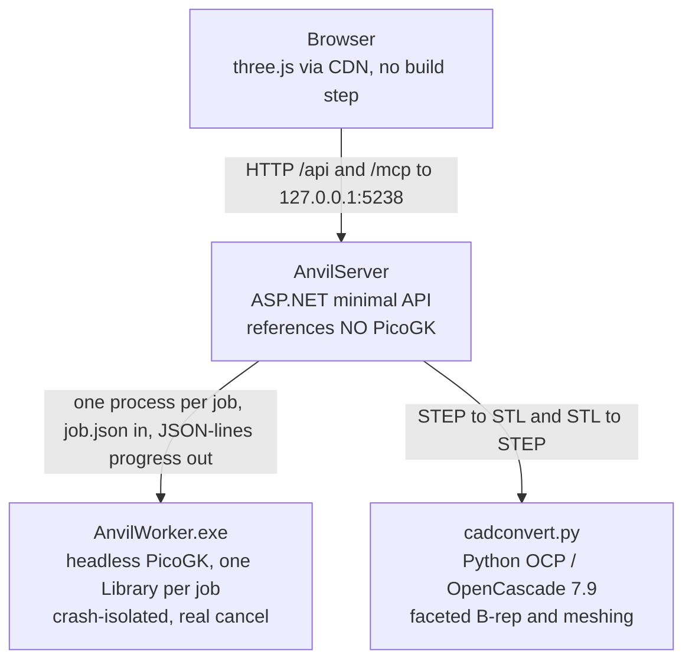

# ANVIL

**Turn solid parts and sealed cavities into printable gyroid/TPMS lattices, and get them back in CAD coordinates.** No slicer can lattice a specific cavity, and nothing else exports a result that boolean-merges straight back into your assembly, in place. ANVIL does both, on your own machine.

[](https://github.com/Delta-Robotics-Inc/anvil/actions/workflows/ci.yml)
[](LICENSE)
[](#platform-note)
[](https://dotnet.microsoft.com/)
[](https://discord.gg/W69MdWMrhH)


## Quickstart

ANVIL builds against a patched fork of [PicoGK](https://github.com/leap71/PicoGK), consumed by project reference. It must be cloned as a **sibling directory**, not inside this repo.

```powershell
cd C:\Users\you\Repos
git clone https://github.com/Delta-Robotics-Inc/anvil.git
git clone <picogk-remote> PicoGK        # see Requirements: a sibling checkout is mandatory

C:\Python314\python.exe -m pip install build123d cadquery-ocp

cd anvil
scripts\run.ps1
```

`run.ps1` builds the solution, verifies the worker exe, Python and sidecar are present, starts the server on `http://127.0.0.1:5238`, waits for `/api/health`, and opens your browser. Add `-NoBrowser` to stay headless.

Then: drag `samples\hollow_bracket.step` onto the drop zone, leave the role as **Part**, and click **GENERATE**. You get a watertight gyroid-filled solid in about a second, ready to export as STL or STEP.

> [!WARNING]
> ANVIL runs **arbitrary C# with your user privileges, by design**, and binds an **unauthenticated** port. Read [Security](#security) before you connect an agent or run a script you did not write.

## Contents

- [Why](#why)
- [The two workflows](#the-two-workflows)
- [Requirements](#requirements)
- [Parameters](#parameters)
- [Sheet vs skeletal](#sheet-vs-skeletal)
- [Zoned lattice](#zoned-lattice)
- [The tool palette](#the-tool-palette)
- [Working in the viewport](#working-in-the-viewport)
- [Export](#export)
- [Flow metrics](#flow-metrics)
- [Coordinate preservation guarantee](#coordinate-preservation-guarantee)
- [Drive it from an agent (MCP)](#drive-it-from-an-agent-mcp)
- [Scripting](#scripting)
- [Security](#security)
- [Architecture](#architecture)
- [HTTP API](#http-api)
- [Testing](#testing)
- [Troubleshooting](#troubleshooting)
- [Platform note](#platform-note)
- [Contributing](#contributing)
- [Credits](#credits)
- [License](#license)

## Why

Parts with large internal voids are a problem for both major additive processes:

- **FDM** fills an enclosed void with support material you can never remove. It is sealed inside.
- **SLS / MJF** traps loose powder in the void with no escape path, adding weight and wasting material.

The fix is to fill the void with a **triply periodic minimal surface (TPMS)** lattice. A TPMS sheet is **self-supporting** (no support material) and **open-celled** (air and powder flow straight through), so it braces the walls while staying light and printable.

Slicers can only apply infill to a whole model, and mesh tools that can build a lattice hand you geometry in their own frame. ANVIL targets a specific cavity and never moves your coordinates, so the exported result drops back into Onshape or Fusion and merges with the original part without manual alignment.

## The two workflows

The role you assign each part decides the mode.

| Roles in the parts list | Mode | What happens |
| --- | --- | --- |
| exactly one **Part** | **single** | The whole solid is latticed. |
| one **Positive** + one **Negative** | **fuse** | The Negative's volume is latticed and voxel-boolean fused into the Positive, producing one watertight part. |

For fuse mode, model the positive and the cavity negative in one shared coordinate system (as `samples\make_test_parts.py` does) and the result inherits that frame.

Only base roles decide the mode. Zone roles layer on top without changing it, and you can also build parts from scratch with [the tool palette](#the-tool-palette).

## Requirements

| | |
| --- | --- |
| **OS** | Windows x64 (10 or 11). See the [platform note](#platform-note). |
| **.NET** | .NET 9 SDK (`dotnet --version` reports `9.0.x`). |
| **PicoGK** | A **sibling checkout** at `..\PicoGK`. The worker references `..\..\PicoGK\src\PicoGK.csproj` directly, so the layout is mandatory. ANVIL tracks a patched fork pinned at `3725be3`; upstream `leap71/PicoGK` is not a drop-in substitute because it keeps sources at the repo root and ships no prebuilt native DLLs. See [CONTRIBUTING](.github/CONTRIBUTING.md#development-setup). |
| **PicoGK native runtime** | Copied automatically. The worker csproj copies `picogk.1.7.dll`, `blosc.dll`, `lz4.dll`, `tbb12.dll`, `zlib1.dll` and `zstd.dll` next to `AnvilWorker.exe` on build. **No System32 PicoGK install is required.** |
| **Python** | Python 3.14 with `build123d` and `cadquery-ocp` (OpenCascade 7.9). Default path `C:\Python314\python.exe`, overridable via `PythonPath` in `appsettings.json`. |
| **Internet, first load only** | The viewer pulls three.js from a CDN. |

`appsettings.json` in the repo root holds the tunables: `PythonPath`, `DataDir`, `MaxConcurrentJobs` and `WorkerPath`.

## Parameters

| Parameter | Meaning | Guidance |
| --- | --- | --- |
| **Pattern** | Gyroid, Schwarz P, Schwarz D, Lidinoid, Neovius. | Gyroid is the robust default: smooth, near-isotropic, printable in any orientation. |
| **Cell size (mm)** | Unit-cell period. | Larger is coarser, lighter and faster. Typical 6 to 12 mm. Default 8. |
| **Wall thickness (mm)** | Thickness of the TPMS sheet. | Keep at or above your printer's minimum wall (roughly line width, so 0.8 to 1.2 mm for FDM). Default 1.2. |
| **Resolution (voxel mm)** | Voxel edge length, the sampling grid. | **Smaller is finer but costs O(n^3) memory and time.** 0.2 to 0.4 mm is a good range. Default 0.3. |
| **Overlap (mm)** *(fuse only)* | How far the lattice grows past the cavity wall for a watertight joint. | 0.2 to 0.5 mm. Too small leaves a hairline seam. Default 0.3. |
| **Smoothing (mm)** | Optional triple-offset that rounds sharp lattice edges. | 0 is off and fastest. 0.1 to 0.3 softens facet ridges. |
| **Bias (mm)** *(skeletal only)* | Shifts the field iso-level, thickening or thinning the struts. Range -5 to +5. | Negative gives thinner struts and a more open channel. Replaces wall thickness in skeletal mode. |
| **Flow axis** | The direction the flow profile and permeability are measured along. | Pick the axis fluid or powder actually travels. Default Z. |
| **Rotation / phase / per-axis cell** | Re-orient or stretch the field before sampling. | Under the advanced **LATTICE** disclosure. See below. |

> [!IMPORTANT]
> **Resolution guard.** The server rejects a job when the largest part dimension divided by the voxel size exceeds roughly **2000 voxels per axis**, and warns above roughly **2e9** total voxels. Start coarse (0.4 mm) and refine.

**Orientation matters for some patterns.** Gyroid is near-isotropic, so rotation mostly changes how walls meet the part surface. **Schwarz P is strongly anisotropic** with straight axis-aligned channels: aligning the flow axis with a channel gives far more open area than sampling off-axis, and a 45 degree rotation deliberately chokes it. For FDM, prefer rotations that keep sheet walls near-vertical along print Z; for powder-bed processes, orientation is unconstrained.

## Sheet vs skeletal

A TPMS field `f(x,y,z) = 0` is one minimal surface dividing space into two interpenetrating volumes. The two modes keep different parts of it solid:

- **Sheet** thickens the *surface itself* into a wall. The solid is a thin membrane and **both** labyrinths either side stay open, giving two independent air networks that never connect. Best stiffness-to-weight, and the safe default for cavity venting.
- **Skeletal** keeps *one* of the two volumes solid and leaves the other as a **single** continuous channel. One connected pore means lower, more predictable flow resistance, at some cost in isotropic stiffness.

Rule of thumb: **sheet** for light bracing and powder escape on both sides, **skeletal** when one clear flow path (cooling, filtration, fluidics) matters more than symmetric stiffness.

## Zoned lattice

Instead of latticing a whole body, section off regions with generative-design-style roles layered on a base part:

- **Zone / Lattice** (blue): the lattice fills here.
- **Zone / Keep** (green): stays solid.
- **Zone / Void** (red): never latticed.

> The promise: the lattice fills the blue zones, stays **SKIN** mm inside the surface, keeps green solid, and never enters red (plus **GROW** mm).

Three offsets control it: **Skin** (inward clearance off the part surface), **Transition** (reserved for a smooth solid-to-lattice blend, accepted and stored but not yet applied) and **Keep-out grow** (outward safety margin around every void).

Zone algebra runs in a fixed order: lattice region = blue zones intersected with the body, pulled `SKIN` mm inside the surface, minus green keeps. The clipped TPMS fills that region and merges back into the body. Then, **last, so void always wins**, the grown red voids are subtracted, and a self-check confirms they are clear. In fuse mode skin is ignored (zeroed with a warning), keeps inside the cavity are re-added solid, and voids may cut into the positive by design.

With zones active, porosity and infill are measured against the **lattice region** rather than the whole bounding volume.

## The tool palette

ANVIL is an object workspace, not just a converter. Seven tools, each opening a contextual panel with part pickers, parameters and a confirm button.

| Tool | What it does | Notes |
| --- | --- | --- |
| **PRIM** | Adds a box, cylinder, sphere or cone. | Mesh-exact. Placed at an explicit center and rests on the plate. |
| **BOOL** | `UNION`, `DIFFERENCE`, `INTERSECT`, or `SMOOTH` (filleted union with a blend radius). | **Consumes both sources**: they stay listed but hidden and locked, so the result is the single active base part. |
| **SHELL** | Hollows a part into a wall, inward, outward or centered. | Thickness must exceed 1.5x voxel. |
| **OFFSET** | Grows or shrinks by a signed distance. | Magnitude must exceed 1.5x voxel. |
| **XFORM** | Non-destructive translate, rotate and scale with live preview. `APPLY` bakes a new part. | Baking is mesh-exact, zero resolution loss. |
| **MIRROR** | Reflects across a plane, winding-corrected. | Mesh-exact. |
| **DUPE** | Instant independent copy. | Synchronous file copy. |

Every tool is **non-destructive**: it runs a worker job producing a **new derived part** with a provenance line in the objects tree (for example `TPMS / GYROID`, `PRIM / BOX 60x40x20`) and a replayable snapshot of its request.

**Mesh-exact vs voxelized.** PRIM, XFORM bake and MIRROR never touch the voxel kernel, so they are geometrically exact. BOOL, SHELL and OFFSET run through PicoGK and are accurate to **plus or minus half a voxel**. Each voxel op carries its own resolution field.

The part store is **in memory**: uploaded and derived parts do not survive a server restart, even though their `data/parts/{id}/` folders remain on disk.

## Working in the viewport

- **Z-up scene** with the build plate at Z0, a view cube (`TOP` / `BOTTOM` / `FRONT` / `BACK` / `LEFT` / `RIGHT`) and an orientation triad.
- **Section view, Onshape style.** Pick an arbitrary plane from the triad, the X/Y/Z chips, or by clicking a flat face. Caps are drawn with **diagonal hatching**, so a cut reads as material and never as a hole. Drag the arrow to move the plane, or nudge it with `Alt`+wheel (`Alt`+`Shift`+wheel for fine steps). The swap chip inverts which half survives.
- **Part-anchored gizmo** with `MOVE`, `ROTATE` and `SCALE`, plus `LAY FLAT` and `DROP`. Grab a selected part anywhere on its surface to slide it across the plate. Rotating auto-drops the part back onto the bed as part of the same action.
- **Undo and redo**, 50 deep: `Ctrl+Z`, `Ctrl+Shift+Z` or `Ctrl+Y`. Imports, tool ops, deletes, moves, role changes and transform edits are all reversible.
- **Linked ghosts.** A finished lattice registers as a **first-class part**, and the sources it was built from stay visible as translucent ghosts linked to it. Move the lattice and its ghosts follow as one unit; delete it and they are released.

## Export

One pipeline handles everything: select any number of parts, pick a format, export.

- **STL** is lossless: it *is* the result mesh.
- **STEP** is **best-effort and faceted**. The sidecar sews the triangle mesh into a faceted-BRep solid where every triangle becomes one planar face. A true analytic B-rep of a gyroid is impossible in any CAD tool, so files are large and the triangle count is budgeted: the worker coarse-remeshes above the target (default 60,000), warns above 150,000, and refuses above 500,000. Roughly 60,000 triangles produces a 135 MB STEP file in about 20 seconds. Prefer STL for slicing; use STEP only when you must boolean-merge in CAD.
- **Multiple parts** export either as a **zip** of one file each, or **combined** into a single merged file.
- Per-part transforms are baked at export time, once, and **nothing is ever recentered**.

## Flow metrics

When a job finishes, the **FLOW** tile reports **geometric** flow descriptors computed from the voxel field and result mesh, sampled in up to 128 bins along the chosen flow axis. These are **fast geometric estimates, not a CFD solution**: no Navier-Stokes, no turbulence, no real fluid. Use them to *compare* lattices and spot a choke, not to predict an absolute pressure drop.

| Metric | Definition | Notes |
| --- | --- | --- |
| **Porosity** | Open (air) fraction of the envelope volume. | Free volume reported in cm3. |
| **Open-area profile** | Open cross-section area per bin vs the part's envelope area. | Plotted as a sparkline. |
| **Choke** | The minimum open cross-section, and where it occurs. | The flow-limiting constriction. Choke ratio compares it to the widest slice. |
| **Specific surface** | Surface area per unit envelope volume. | High values mean good heat and mass transfer, and more drag. |
| **Hydraulic diameter** | `4 * porosity / specific surface`. | The standard porous-media characteristic pore size. |
| **Permeability** | Kozeny-Carman, in m2. | Geometric permeability of the pore network along the flow axis. |
| **Pressure drop** | Darcy, at the reference flow rate. | Labelled EST. Linear in flow, derived from the geometric permeability. |

The tile also surfaces worker warnings, for example a sheet lattice's "two independent air networks" note or a near-total choke.

## Coordinate preservation guarantee

Every stage (worker, sidecar and viewer) operates in the **source world frame**. STLs load force-MM and save MM, TPMS fields are world-anchored, no boolean recenters, and the viewer fits the camera with a bounding-box union instead of moving the mesh.

Consequently **the exported part lands exactly where the original did**, to within half a voxel. Import the STEP into Onshape or Fusion and it slots into place and boolean-merges with the source part, with no manual mesh alignment. Even `CENTER` in the transform panel is an explicit, visible, clearable translate, never a silent recenter.

## Drive it from an agent (MCP)

ANVIL hosts an in-process [Model Context Protocol](https://modelcontextprotocol.io) server at `/mcp` (streamable HTTP, stateless) exposing **20 tools**. Any MCP client can list parts, run every tool op, generate lattices, run scripts and export results.

```bash
claude mcp add anvil --transport http --url http://127.0.0.1:5238/mcp
```

Tools that spawn jobs poll to completion internally (250 ms, 10 minute cap) and return the terminal job as JSON, so an agent sees synchronous results. Structured worker errors, including a script's compile diagnostics, pass straight through.

Covered surfaces: `list_parts`, `add_part_from_file`, `delete_part`, `duplicate_part`, `create_primitive`, `boolean_op`, `merge_parts`, `shell_part`, `offset_part`, `transform_part`, `mirror_part`, `generate_infill`, `get_job`, `cancel_job`, `export_step`, `get_result_stl`, `run_script`, `list_scripts`, `get_script`, `save_script`.

**Connecting an agent to `/mcp` means that agent can run code on this machine.** See [Security](#security).

## Scripting

ANVIL compiles and runs user **C# scripts** (`.csx`) against the PicoGK and `Anvil.Worker` APIs in a per-job worker process. This is the escape hatch for computational parts the fixed palette cannot express: parametric heat exchangers, functionally graded lattices, anything expressible with signed distance fields. Run one from the **SCRIPTS** panel, `POST /api/scripts/run`, or the `run_script` MCP tool.

Globals available unqualified: `Params` and the typed readers `ParamF` / `ParamS` / `ParamB`, `VoxelSizeMM`, `SavePart(name, Voxels)` (meshes the field, removes floating islands, watertight-checks and registers it), `SavePart(name, Mesh)`, and `Log(msg)`. Imported automatically: `PicoGK` (`Voxels`, `Mesh`, `IImplicit`, `BBox3`, booleans and offsets), `Anvil.Worker` (`MeshUtil`, `TPMSWall`), plus `System`, `System.Numerics` and a static `Math`.

Two annotated seeds live in [`scripts-library/`](scripts-library):

| Seed | What it makes |
| --- | --- |
| `heat_exchanger_core.csx` | A parametric gyroid heat-exchanger core. The template for this style of work. |
| `graded_lattice_puck.csx` | A 40 by 15 mm puck filled with a radially graded skeletal gyroid via a custom inline `IImplicit`. |

Scripts you save land in `data/scripts/` (gitignored, slugified, path traversal rejected). Part provenance stores the script name, params and SHA-256, never the source.

> [!CAUTION]
> **Scripts execute arbitrary C# with your full user privileges. There is no sandbox.** Treat a `.csx` exactly like an executable someone handed you: read it before you run it.

## Security

**Read this before exposing the port or connecting an agent.** The full policy, including what is and is not a reportable vulnerability, is in [SECURITY.md](.github/SECURITY.md).

- **No sandbox.** Scripts run arbitrary C# and can read, write and delete anything your account can. MCP tools run geometry ops, and `add_part_from_file` reads arbitrary absolute paths.
- **The server binds `127.0.0.1` only and has no authentication.** Anyone who can reach the port can drive every tool and run arbitrary code. Do not bind it to a public interface, port-forward it, or put it behind a tunnel.
- **Connecting an agent to `/mcp` grants that agent code execution on this machine.** Only connect agents you trust.
- Per-job worker processes give crash isolation and cleanup, **not** a security boundary.

To report a vulnerability, use [private vulnerability reporting](https://github.com/Delta-Robotics-Inc/anvil/security/advisories/new) or email mark@deltaroboticsinc.com. Never open a public issue for one.

## Architecture

Three cooperating processes keep PicoGK's native constraints (one `Library` per process, process-global voxel size, native crashes kill the host) isolated from the web host.



The server only shells out: it queues jobs (bounded by `MaxConcurrentJobs`), spawns one `AnvilWorker.exe` per job with a `job.json`, parses JSON-lines progress from stdout, and calls the Python sidecar for STEP. **All voxel math lives in the worker.**

## HTTP API

Base path `/api`, JSON is camelCase, server binds `http://127.0.0.1:5238`.

| Method | Route | Purpose |
| --- | --- | --- |
| `GET` | `/api/health` | Liveness plus worker and Python paths. |
| `GET` `POST` `DELETE` | `/api/parts` | List, upload (`.stl` / `.step` / `.stp`) and delete parts. |
| `GET` | `/api/parts/{id}/mesh.stl` | Binary STL for the preview. |
| `POST` | `/api/ops` | Run a tool op, producing a new derived part. `duplicate` returns `200`; everything else returns `202` and finishes as a job. |
| `POST` | `/api/jobs` | Start a lattice generate. Returns `202`. |
| `GET` `POST` | `/api/jobs/{id}` , `/api/jobs/{id}/cancel` | Poll status (the UI polls at 500 ms) or kill the worker. |
| `POST` | `/api/export` | Unified export. Returns `202` with an export id. |
| `GET` | `/api/export/{id}` , `/api/export/{id}/file` | Poll, then download. `409` if not ready. |
| `POST` | `/api/scripts/run` | Compile and run a C# script. |
| `GET` `POST` | `/api/scripts` | Browse and save the script library. |
| n/a | `/mcp` | The MCP endpoint. |

Validation is strict and returns `400` with an actionable message: unknown op or boolean kind, non-distinct or missing inputs, feature sizes at or below 1.5x voxel, and anything blowing the resolution guard.

> [!NOTE]
> The TRS translation field is **`translateMM`** (millimetres) everywhere: op `inputs[].transform`, the job `transforms` map and the export `transforms` map. Sending `translate` or `position` is silently ignored. Transforms compose as `scale -> rotX -> rotY -> rotZ -> translate` in worker, server and viewer alike.

## Testing

Three PowerShell harnesses cover the worker, HTTP, scripting and MCP surfaces. Each builds to a scratch output and runs its own server on an isolated port and data directory, so a live dev server on 5238 is never touched. Each prints an `N passed / N failed / N total` summary and exits non-zero on failure.

```powershell
powershell -ExecutionPolicy Bypass -File scripts\test_ops.ps1      # worker CLI, driven directly
powershell -ExecutionPolicy Bypass -File scripts\test_api.ps1      # HTTP surface incl. export
powershell -ExecutionPolicy Bypass -File scripts\test_scripts.ps1  # Roslyn scripting + MCP
```

A clean `dotnet build Anvil.sln` plus all three green is the merge gate. `test_api.ps1` and `test_scripts.ps1` accept `-Port` (default 5239).

## Troubleshooting

| Symptom | Cause and fix |
| --- | --- |
| `error MSB3202: project file ..\..\PicoGK\src\PicoGK.csproj was not found` | PicoGK is missing or in the wrong place. It must be a **sibling** of `anvil`, not inside it, and it must be the patched fork (upstream keeps sources at the repo root). See [Requirements](#requirements). |
| `run.ps1` says the worker exe is missing | The build failed. Run `dotnet build Anvil.sln` and read the errors. |
| `run.ps1` cannot find Python | Set `PythonPath` in `appsettings.json` to your interpreter, and confirm `build123d` and `cadquery-ocp` are installed into *that* interpreter. |
| STEP upload or export fails immediately | The sidecar could not import `OCP`. Run `C:\Python314\python.exe -c "import OCP, build123d"` to see the real error. |
| Job rejected with a resolution error | The part is too big for that voxel size. Raise the voxel size; the guard trips above roughly 2000 voxels per axis. |
| STEP export refuses or takes minutes | The mesh exceeds the triangle budget. Lower the STEP target, raise the voxel size, or export STL instead. |
| Parts vanished after restarting the server | Expected. The part store is in memory only. |
| The 3D preview is blank | three.js loads from a CDN, so the first load needs internet. Check the browser console. |
| A shell or offset op is rejected | The feature size must exceed 1.5x the voxel size. |

Server logs are at `data\server.out.log` and `data\server.err.log`.

## Platform note

PicoGK ships an `osx-arm64` native runtime, so the worker could in principle run on Apple Silicon. But the launcher (`scripts\run.ps1`), the default paths and the native-DLL copy step are **Windows-first and untested elsewhere**. Contributions that make this portable are welcome.

## Contributing

Yes, please. See **[CONTRIBUTING.md](.github/CONTRIBUTING.md)** for the sibling-checkout dev setup, the test suites, code style, the coordinate conventions that are not negotiable, and the DCO sign-off (`git commit -s`).

Also: [Code of Conduct](.github/CODE_OF_CONDUCT.md) | [Security policy](.github/SECURITY.md) | [Getting help](.github/SUPPORT.md) | [Changelog](CHANGELOG.md)

Documentation fixes and new `scripts-library/` examples are genuinely useful and need no geometry expertise.

## Credits

- **[PicoGK](https://github.com/leap71/PicoGK)** by LEAP 71: the voxel geometry kernel doing all the heavy lifting (booleans, offsets, TPMS rendering, meshing). Apache-2.0. ANVIL builds against a patched fork.
- **`worker/TPMSWall.cs`**: the TPMS signed-distance implicit is copied verbatim (namespace changed only) from the PicoGK fork's `examples/03_SimpleShapes/GyroidCylinder.cs`, which carries a `CC0-1.0` header.
- **[build123d](https://github.com/gumyr/build123d)** and **[cadquery-ocp](https://github.com/CadQuery/ocp)**: STEP import and faceted-BRep writing via OpenCascade.
- **[three.js](https://threejs.org)**: the browser viewer.
- **[bumpmesh.com](https://bumpmesh.com) / CNCKitchen `stlTexturizer`**: UX inspiration only for the drag-drop to parameters to preview to export loop. No code was copied, and its surface-displacement math is unrelated to this volumetric work.

Built by [Delta Robotics Inc.](https://deltaroboticsinc.com)

## License

Licensed under the **Apache License, Version 2.0**. SPDX identifier: `Apache-2.0`.

See [LICENSE](LICENSE) for the full text and [NOTICE](NOTICE) for attribution.
